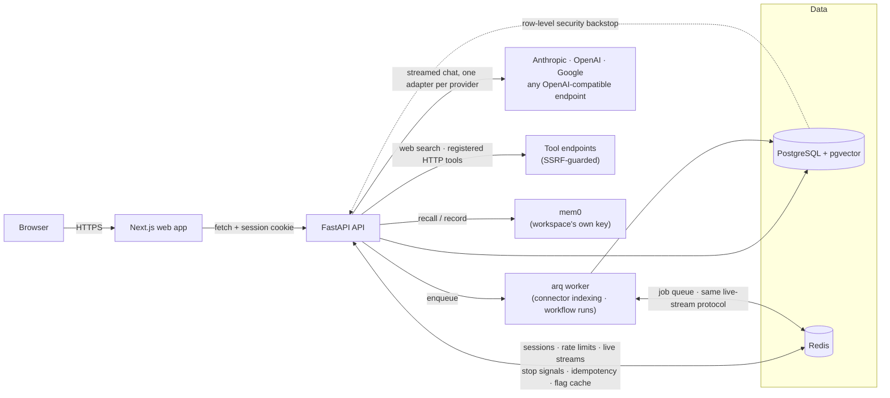

# ReCore

A multi-workspace chat platform that talks to any LLM, using API keys each workspace brings itself.
Multiple workspaces, multiple people, multiple providers — one platform, one account.

See [`docs/ARCHITECTURE.md`](docs/ARCHITECTURE.md) for how it's built and why, including the parts
that were deliberately left out.

## What it does

- **Bring your own key** — register an Anthropic, OpenAI, Google, or any OpenAI-compatible
  (Groq, Ollama, OpenRouter, vLLM, …) credential per workspace; keys are envelope-encrypted at rest
  and validated live before they're ever stored.
- **Chat, streamed and resumable** — Server-Sent Events over a Redis stream, so a refreshed tab or
  a dropped connection picks the reply back up mid-answer instead of losing it. Stop works across
  processes; a retried send attaches to the in-flight generation instead of billing twice.
- **Tools the model can actually call** — a built-in web search (Tavily), plus any HTTP endpoint a
  workspace registers as a tool: name, description, JSON Schema parameters, method, URL, and an
  optional secret header. The agent loop executes calls, feeds results back, and records every one
  in the transcript — bounded by a timeout, a result-size cap, and a 5-iteration ceiling.
- **Assistants** — save a name, instructions, an optional preferred model and a set of tools, then
  point a conversation at it. Instructions and tools are resolved live on every send, so editing an
  assistant reaches conversations already using it.
- **ReMind memory** — an assistant recalls curated facts its creator taught it, plus — separately,
  and never visible to anyone else — what it's privately learned about whichever member is chatting
  with it, backed by [mem0](https://mem0.ai) on a workspace's own key.
- **Delegation** — one assistant can hand a task to another, offered to the model as an `ask_<name>`
  tool. The delegate runs its own tool-calling loop (its own model, memory, and tools if it has
  them) and hands back an answer; depth is always one, so a delegate never delegates further.
- **ReStore knowledge** — a workspace registers connectors (a website to crawl, or a set of uploaded
  files), indexed in the background into pgvector on a workspace-chosen embedding model. An
  assistant with connectors attached retrieves relevant chunks into its prompt and cites them in a
  live sources sidebar, persisted per reply.
- **ReFlow workflows** — a saved, ordered chain of assistant steps that runs in the background with
  no chat turn: each step's prompt is built from the run's own input (typed text, uploaded files,
  or both) and earlier steps' completed outputs, watchable live and replayable from a run history
  page. Each workflow can expose a webhook URL that external systems POST to in order to start a run.
- **Workspaces, roles, and invitations** — viewer/member/admin/owner, enforced by one dependency
  chain and backstopped by Postgres row-level security.
- **Feature flags** — user → workspace → percentage rollout → default resolution, cached in Redis
  and invalidated instantly on edit. A per-provider killswitch is the platform's own admin lever.
- **Attachments** — PDF, DOCX, PPTX, XLSX and text files extract into the next message's context;
  images (HEIC included) pass through to vision-capable models, and are refused pre-flight by
  models that can't read them.
- **Usage and audit** — every generation's (and workflow step's) tokens and cost land in an
  append-only ledger; every privileged action (who invited whom, whose key got rejected, which flag
  got flipped, who registered a tool) lands in an immutable audit trail.

## Architecture



The rule that keeps it maintainable: **routers never contain logic, services never import
FastAPI.** A service takes plain arguments and is testable without an HTTP client; a router just
wires dependencies to it. See `docs/ARCHITECTURE.md` §2–§4 for the full reasoning.

## Quickstart

```bash
git clone <this repo> && cd ReCore
docker compose -f infra/docker-compose.yml up --build
```

That's the whole setup — `postgres`, `redis`, `api`, `worker`, and `web` all start together. On
first boot the API runs its migrations and seeds a demo account:

- **Web** — http://localhost:3000
- **API** — http://localhost:8000 (interactive docs at `/docs`)
- **Sign in** with `demo@example.com` / `ReCoreDemo123!` — a workspace is already waiting for you.

The demo workspace won't have a live model to chat with, since that needs a real provider key this
repo obviously can't ship — add one yourself under **Settings → Providers** once you're signed in,
or set `SEED_PROVIDER_API_KEY` (and optionally `SEED_PROVIDER`, default `anthropic`) in the `api`
service's environment before the first boot and one gets registered and enabled automatically.

Re-running `docker compose up` is safe at any point — migrations and the seed are both idempotent.

### Turning on optional features

Every vertical beyond core chat sits behind its own feature flag, off by default, administered at
`/admin/flags` — which requires a superuser. Nothing in the app grants that, so promote your
account once, directly against the database:

```bash
docker compose -f infra/docker-compose.yml exec postgres \
  psql -U recore -d recore -c "update users set is_superuser = true where email = 'demo@example.com';"
```

Then flip a flag on for your workspace at `/admin/flags`:

| Flag | Unlocks | Settings page |
|---|---|---|
| `tools` | Web search (paste a [Tavily](https://tavily.com) key) and custom HTTP tools | Settings → Tools |
| `memory` | ReMind recall — needs a [mem0](https://mem0.ai) key | Settings → Assistants |
| `delegation` | One assistant handing a task to another | Settings → Assistants (delegate picker) |
| `knowledge` | ReStore connectors and retrieval | Settings → Knowledge |
| `workflows` | ReFlow background step chains | Settings → Workflows |

Assistants themselves need no flag — they're at **Settings → Assistants**, open to any member.

## Repository layout

```
apps/api/          FastAPI backend (Python 3.12)
  app/core/           settings, db/redis engines, crypto, SSRF guard, tracing, middleware
  app/models/         SQLAlchemy ORM models
  app/schemas/        Pydantic request/response shapes
  app/services/       business logic — no FastAPI imports, fully unit-testable
  app/routers/v1/     HTTP surface — thin, delegates to services
  app/providers/      one adapter per LLM backend behind a shared protocol (chat + embeddings)
  app/tools/          tool executors (web search, HTTP) + the bounded dispatcher
  app/memory/         the mem0 client wrapper ReMind sits on
  app/knowledge/      website crawling + text chunking for ReStore's indexer
  app/workflows/      ReFlow's step-prompt template renderer
  app/workers/        arq background jobs — connector indexing, workflow runs
  app/deps/           the auth → workspace → role dependency chain, plus flag gates
  app/scripts/        one-off scripts (demo seed, load test)
  migrations/         Alembic, one revision per schema change
  tests/              pytest, 437 tests
apps/web/           Next.js 16 (App Router), React 19, Tailwind 4
  app/                routes — auth, workspace, chat, settings, admin
  lib/                one typed API client per domain + React context
  components/         shared UI
infra/              docker-compose.yml (postgres+pgvector, redis, api, worker, web), Dockerfiles
docs/               ARCHITECTURE.md
```

## Local development without Docker

Run Postgres and Redis via compose, everything else natively for hot reload:

```bash
docker compose -f infra/docker-compose.yml up postgres redis

cd apps/api && cp .env.example .env   # then fill in MASTER_KEY (see the comment in the file)
uv sync && uv run alembic upgrade head && uv run uvicorn app.main:app --reload

# a second terminal, for connector indexing and workflow runs:
cd apps/api && uv run arq app.workers.main.WorkerSettings

cd apps/web && pnpm install && pnpm dev
```

## Testing

```bash
cd apps/api && uv run ruff check . && uv run mypy app && uv run pytest -q
cd apps/web && pnpm lint && pnpm exec tsc --noEmit && pnpm build
```

The API test suite talks to a real Postgres/Redis (via `docker compose up postgres redis`), but
never the ones a running `docker compose up` dev stack is using interactively: `tests/conftest.py`
forces a separate `_test`-suffixed database and Redis db index before any app code loads, so
running the suite locally can never truncate or flush data you're actually looking at in the app.
The same real database is also where `index_connector` and `run_workflow` are tested directly,
bypassing arq's own queue — see `test_index_connector.py` / `test_run_workflow.py`.

There's also one end-to-end happy path (signup → login → create a workspace) via Playwright,
against a real running stack rather than a mocked one:

```bash
cd apps/web && pnpm exec playwright install chromium && pnpm e2e
```

It defaults to `http://localhost:3000` (override with `E2E_BASE_URL`) — have `docker compose up`
running first. It stops short of sending a chat message, since that needs a real provider key.

And a load test against concurrent streaming generations, no real provider key needed (see the
script's own docstring for what it found the first time it was run):

```bash
cd apps/api && uv run python -m app.scripts.load_test
```

CI runs the same API and web checks on every push and pull request.

## Security

- Argon2id password hashing; opaque Redis-backed sessions, not JWTs
- Envelope-encrypted secrets — provider keys, the mem0 key, the web-search key, and each HTTP
  tool's secret header value all use the same AES-256-GCM scheme, where a master key wraps a random
  per-secret data key. Plaintext is never a field on any response schema.
- SSRF guard on every user-supplied URL — provider base URLs, tool endpoints, and ReStore's website
  connectors, all re-checked immediately before each call (and every crawl redirect hop), not just
  when the URL was registered
- Tool execution is bounded: a 15s timeout, an 8,000-character result cap, and a 5-iteration
  ceiling per generation, so one bad tool degrades a single turn rather than a whole run
- Tenancy enforced by one dependency chain (`current_user → workspace_ctx → require_role`), 404
  (not 403) for non-members, and backstopped by Postgres row-level security under a dedicated
  low-privilege runtime role — see the RLS migration's own docstring for the details worth knowing
  before touching it
- CSP, HSTS, X-Content-Type-Options, and Referrer-Policy on every response, API and web alike
- Every privileged action — invites, role changes, credential and tool and assistant lifecycle,
  flag edits, connector and workflow lifecycle — writes an immutable audit row

`docs/ARCHITECTURE.md` §19 lists the known gaps in the same place, rather than leaving them
implied: CSRF is issued but only enforced on logout, the SSRF guard still has a DNS-rebind TOCTOU
window, rate limiting doesn't cover chat, logs have no redaction processor behind the
don't-log-secrets discipline, and CI has no dependency or secret scanning.

## Status

Feature-complete for what it set out to be: identity, workspaces and roles, the LLM registry, chat
with resumable streaming, feature flags, attachments, metering and audit, RLS hardening, tool
calling, assistants, ReMind memory, one-level delegation, ReStore knowledge retrieval, and ReFlow
background workflows.

What's deliberately absent — programmatic API keys, usage rollup tables, workflow schedule/webhook
triggers and approval resume, multi-level delegation, per-dimension ANN indexing — is listed with
the reasoning in `docs/ARCHITECTURE.md` §21.
