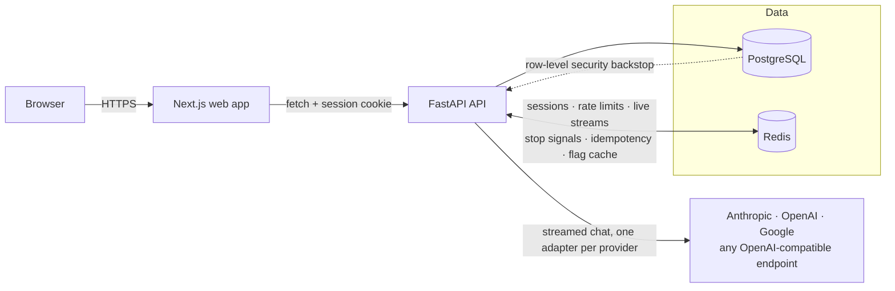

# ReCore

A multi-workspace chat platform that talks to any LLM, using API keys each workspace brings
itself. Multiple workspaces, multiple people, multiple providers — one platform, one account.

See [`docs/ARCHITECTURE.md`](docs/ARCHITECTURE.md) for the full architecture and phased build plan
this was built against.

## What it does

- **Bring your own key** — register an Anthropic, OpenAI, Google, or any OpenAI-compatible
  (Groq, Ollama, OpenRouter, vLLM, ...) credential per workspace; keys are envelope-encrypted at
  rest and validated live before they're ever stored.
- **Chat, streamed and resumable** — Server-Sent Events over a Redis stream, so a refreshed tab or
  a dropped connection picks the reply back up mid-answer instead of losing it.
- **Workspaces, roles, and invitations** — viewer/member/admin/owner, enforced by one dependency
  chain and backstopped by Postgres row-level security.
- **Feature flags** — user → workspace → percentage rollout → default resolution, cached in Redis
  and invalidated instantly on edit. A per-provider killswitch is the platform's own admin lever.
- **Attachments** — upload a file into a chat (behind its own flag) and its text rides along with
  the next message.
- **Usage and audit** — every generation's tokens and cost land in an append-only ledger; every
  privileged action (who invited whom, whose key got rejected, which flag got flipped) lands in an
  immutable audit trail.

## Architecture



The rule that keeps it maintainable: **routers never contain logic, services never import
FastAPI.** A service takes plain arguments and is testable without an HTTP client; a router just
wires dependencies to it. See `docs/ARCHITECTURE.md` §2–§4 for the full reasoning.

## Quickstart

```bash
git clone <this repo> && cd ReCore
docker compose -f infra/docker-compose.yml up --build
```

That's the whole setup. On first boot the API runs its migrations and seeds a demo account:

- **Web** — http://localhost:3000
- **API** — http://localhost:8000 (interactive docs at `/docs`)
- **Sign in** with `demo@example.com` / `ReCoreDemo123!` — a workspace is already waiting for you.

The demo workspace won't have a live model to chat with, since that needs a real provider key this
repo obviously can't ship — add one yourself under **Settings → Providers** once you're signed in,
or set `SEED_PROVIDER_API_KEY` (and optionally `SEED_PROVIDER`, default `anthropic`) in the `api`
service's environment before the first boot and one gets registered and enabled automatically.

Re-running `docker compose up` is safe at any point — migrations and the seed are both idempotent.

## Repository layout

```
apps/api/          FastAPI backend
  app/core/           settings, db/redis engines, crypto, tracing, middleware
  app/models/         SQLAlchemy ORM models
  app/schemas/        Pydantic request/response shapes
  app/services/       business logic — no FastAPI imports, fully unit-testable
  app/routers/v1/     HTTP surface — thin, delegates to services
  app/providers/      one adapter per LLM backend behind a shared protocol
  app/deps/           the auth → workspace → role dependency chain
  app/scripts/        one-off scripts (the demo seed)
  migrations/         Alembic, one revision per schema change
  tests/              pytest, ~170 tests
apps/web/           Next.js (App Router) frontend
  app/                routes — auth, workspace, chat, settings, admin
  lib/                typed API clients + React context per domain
  components/         shared UI
infra/              docker-compose.yml, Dockerfiles for both apps
docs/               ARCHITECTURE.md — the plan this was built from
```

## Local development without Docker

Run Postgres and Redis via compose, everything else natively for hot reload:

```bash
docker compose -f infra/docker-compose.yml up postgres redis

cd apps/api && cp .env.example .env   # then fill in MASTER_KEY (see the comment in the file)
uv sync && uv run alembic upgrade head && uv run uvicorn app.main:app --reload

cd apps/web && pnpm install && pnpm dev
```

## Testing

```bash
cd apps/api && uv run ruff check . && uv run mypy app && uv run pytest -q
cd apps/web && pnpm lint && pnpm exec tsc --noEmit && pnpm build
```

The API test suite talks to a real Postgres/Redis (via `docker compose up postgres redis`), but
never the ones a running `docker compose up` dev stack is using interactively: `tests/conftest.py`
forces a separate `_test`-suffixed database and Redis db index before any app code loads, so
running the suite locally can never truncate or flush data you're actually looking at in the app.

## Security

- Argon2id password hashing; opaque Redis-backed sessions, not JWTs; double-submit CSRF cookie
- Envelope-encrypted provider credentials (AES-256-GCM, master key wraps a random per-credential
  data key); the plaintext key is never a field on any response schema
- SSRF guard on custom provider base URLs — resolve, reject private/loopback ranges, then connect
- Tenancy enforced by one dependency chain (`current_user → workspace_ctx → require_role`), 404
  (not 403) for non-members, and backstopped by Postgres row-level security under a dedicated
  low-privilege runtime role — see the RLS migration's own docstring for the details worth
  knowing before touching it
- CSP, HSTS, X-Content-Type-Options, and Referrer-Policy on every response, API and web alike
- Every privileged action — invites, role changes, credential create/delete and validation
  failures, flag edits — writes an immutable audit row

None of this is exhaustive; `docs/ARCHITECTURE.md` §10 has the full checklist and what's still
explicitly deferred (a DNS-rebind TOCTOU gap on the SSRF guard, CSRF enforcement not yet wired
past the logout route, no rate limiting beyond auth).

## Build status

All 8 phases in `docs/ARCHITECTURE.md`'s build order are complete: Foundation, Identity,
Workspaces & Roles, LLM Registry, Chat, Flags & Attachments, Metering, and Hardening.
